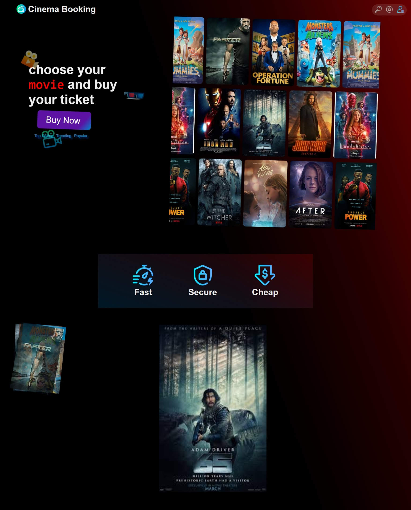
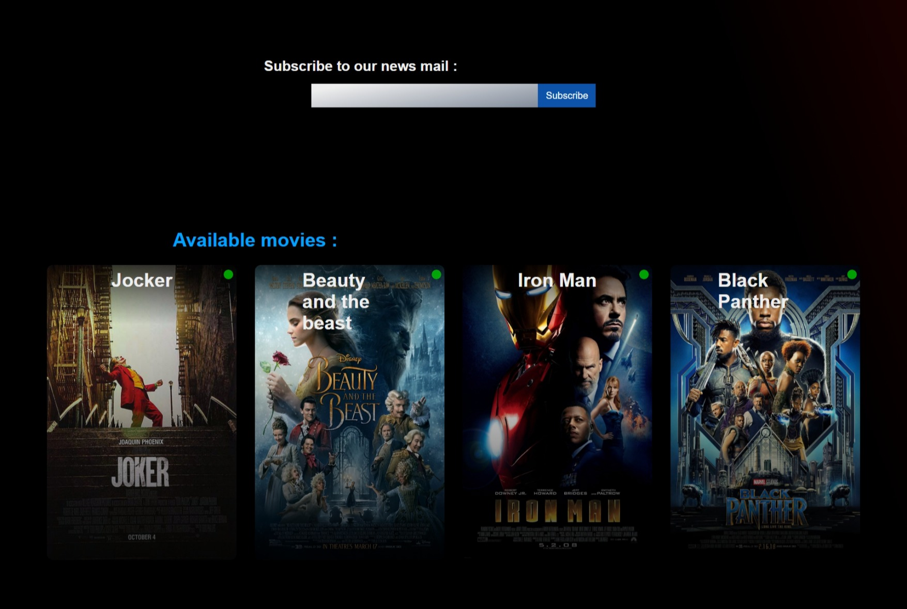
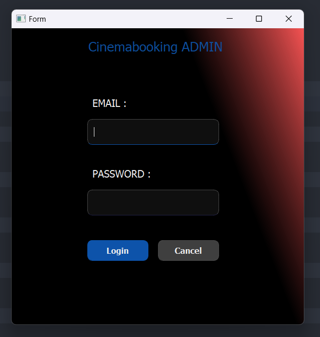

# Read Me

## [👀 Live-Server](http://cinemabooking.rf.gd/)

<div align='center'>
  
</div>

<div align='center'>
  
  
</div>

<div align='center'>
  
  
</div>

---

### Table of Contents 👋

- [Description 📄](#description)
- [How To Use 📙](#how-to-use)
- [References ](#references)
- [License ](#license)
- [Author Info ✆](#author-info)

---

## Description

### CinemaBooking is a comprehensive movie ticket booking website that brings convenience and efficiency to the movie-going experience. With a seamless integration of PHP, JavaScript, Python, PyQt5, HTML5, CSS, and Qt Designer, CinemaBooking offers a user-friendly interface and robust features for both users and administrators. ###

### Features: ###

1. User-friendly Booking System: The website provides a simple and intuitive interface for users to browse movies, select showtimes, and reserve tickets effortlessly. With real-time availability updates and seat selection, CinemaBooking ensures a seamless booking process.

2. Secure Payment Integration: Users can securely make online payments using popular payment gateways, providing a hassle-free and secure transaction experience.

3. Dynamic Movie Listings: CinemaBooking offers a dynamic movie listing feature, allowing administrators to easily manage and update movie information such as title, synopsis, genre, and duration. This ensures users always have access to the latest movie offerings.

4. Showtime Management: Administrators can efficiently manage showtimes for different movies, enabling easy scheduling and coordination with theater operations. This ensures accurate and up-to-date showtime information for users.

5. Ticket Pricing and Promotion: Customize ticket prices based on factors such as movie type, seat category, and showtime. Additionally, administrators can create and manage promotional offers, such as discounts and combo deals, to attract more customers.

6. Administration Panel: The integrated administration panel empowers cinema administrators with comprehensive control over the website. From managing user accounts and movie listings to handling bookings and generating reports, the panel offers a centralized hub for efficient management.

7. Responsive Design: CinemaBooking is built with HTML5, CSS, and responsive design principles, ensuring seamless user experiences across various devices, including desktops, tablets, and mobile phones.

8. Visual Customization: With Qt Designer and CSS, administrators can easily customize the website's appearance, branding, and layout to match their cinema's unique style and identity.

CinemaBooking aims to revolutionize the movie ticket booking process, providing a user-friendly platform for both moviegoers and cinema administrators. We continuously strive to enhance the website's features and user experience. Your feedback and contributions are highly appreciated.

To get started, please refer to the documentation included in the repository, which provides detailed instructions on installation, configuration, and usage.
Join us in transforming the movie ticket booking experience with CinemaBooking!

* The CinemaBooking Team

#### Technologies 

- HTML 5
- CSS 3
- Java Script
- Python 3
  ##### - Python librarys :
  - PyQt5
  - mysql
  - datetime
  - json

[Back To The Top](#read-me)

---

## How To Use

#### Installation 

1. download the latest release windows executable and source code from the release tab
2. deploy the source code on your server with mysql and apache in it
3. execute the sql file in your database
4. enjoy !

#### API Reference 

```html
<p>No API for now, still in production</p>
```

[Back To The Top](#read-me)

---

## References

[Back To The Top](#read-me)

---

## License

MIT License 

Copyright (c) 2022 Wissem Zidi

Permission is hereby granted, free of charge, to any person obtaining a copy
of this software and associated documentation files (the "Software"), to deal
in the Software without restriction, including without limitation the rights
to use, copy, modify, merge, publish, distribute, sublicense, and/or sell
copies of the Software, and to permit persons to whom the Software is
furnished to do so, subject to the following conditions:

The above copyright notice and this permission notice shall be included in all
copies or substantial portions of the Software.

THE SOFTWARE IS PROVIDED "AS IS", WITHOUT WARRANTY OF ANY KIND, EXPRESS OR
IMPLIED, INCLUDING BUT NOT LIMITED TO THE WARRANTIES OF MERCHANTABILITY,
FITNESS FOR A PARTICULAR PURPOSE AND NONINFRINGEMENT. IN NO EVENT SHALL THE
AUTHORS OR COPYRIGHT HOLDERS BE LIABLE FOR ANY CLAIM, DAMAGES OR OTHER
LIABILITY, WHETHER IN AN ACTION OF CONTRACT, TORT OR OTHERWISE, ARISING FROM,
OUT OF OR IN CONNECTION WITH THE SOFTWARE OR THE USE OR OTHER DEALINGS IN THE
SOFTWARE.

[Back To The Top](#read-me)

---

## Author Info

### Created By Wissem Zidi 

- [Website ](https://wissem-zidi-ofc.netlify.com)
- [Email ](https://mail.google.com/mail/u/0/?fs=1&tf=cm&source=mailto&to=wissem.zidi.contact@gmail.com)
- [Github ](https://github.com/Wissem-Zidi/)

[Back To The Top](#read-me)

**Have a nice day!** 🚀
